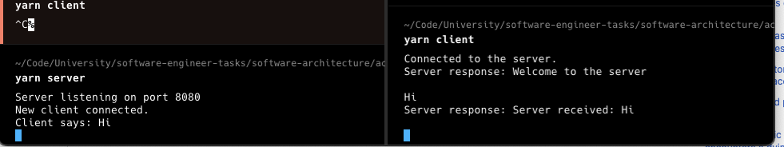

# Client/Server Architecture in TypeScript

This project demonstrates the implementation of a basic client/server architecture using **TypeScript** and **Node.js**. The client and server communicate over TCP, where multiple clients can connect simultaneously to the server through different terminal sessions. The server handles requests from each client, responds to them, and manages multiple connections independently.

---

## Project Structure
```
software-architecture/
└── activity_3_client_server_arquitecture/
    ├── client.ts
    ├── server.ts
    ├── package.json
    └── tsconfig.json
```

### Features:
1. **Multiple Client Connections**: The server can handle multiple client connections, each from different terminal sessions.
2. **Message Exchange**: Clients send messages to the server, and the server acknowledges the messages and sends a response back.
3. **TCP Communication**: Uses Node.js `net` module to establish TCP connections.

## Prerequisites

Before running the project, ensure that you have the following installed:

1. **Node.js**: You can download Node.js from [here](https://nodejs.org/).
   - Verify the installation by running:
     ```
     node -v
     ```

2. **Yarn**: Yarn is a package manager that can be installed via npm (which comes with Node.js):
   - Install Yarn globally by running:
     ```
     npm install --global yarn
     ```
   - Verify the installation by running:
     ```
     yarn -v
     ```

## Installation and Setup

Once you have Node.js and Yarn installed, follow these steps to set up the project:

1. **Clone the project** or navigate to the folder `software-architecture/activity_3_client_server_arquitecture/` where the project resides.

2. **Install Dependencies**:
   - In the project root directory (`activity_3_client_server_arquitecture`), run the following command to install the necessary dependencies:
     ```bash
     yarn install
     ```

3. **Configure TypeScript**:
   - The project is configured with TypeScript. You don’t need to manually compile TypeScript, as the project uses `ts-node` to run the scripts directly.

## Running the Application

There are two main components to the application: the **server** and the **client**.

### Start the Server

1. Open a terminal in the project root directory and run the following command:
   ```bash
   yarn server
   ```
   This command starts the server and listens for incoming connections on **port 8080**. You should see the message: 
   ```
   Server listening on port 8080
   ```

### Connect Clients

2. In separate terminal windows (open as many as you want), you can run the following command to start clients:
   ```bash
   yarn client
   ```
   Each client connects to the server, and you should see the message: 
   ```
   Connected to the server.
   ```

### Interaction Between Client and Server

- **Client**: After connecting to the server, you can type messages in the client terminal, and those messages will be sent to the server.
- **Server**: The server will receive the message, log it, and send back a confirmation response to the client. For example:
  - Client: 
    ```
    Hello from client 1!
    ```
  - Server logs:
    ```
    Client says: Hello from client 1!
    ```
  - Client response:
    ```
    Server received: Hello from client 1!
    ```

### Stopping the Server

You can stop the server by pressing `Ctrl + C` in the terminal where the server is running.

---

## Scripts

In the `package.json` file, you can find two scripts defined under `"scripts"`:
- `"client"`: Runs the client (`yarn client`)
- `"server"`: Runs the server (`yarn server`)

You can use these commands to easily start the server and clients without manually running the TypeScript files with `ts-node`.

---

## Additional Information

### Project Components:
1. **server.ts**: This file contains the logic for the server. It listens for incoming client connections, processes messages, and sends responses back to the clients.
2. **client.ts**: This file contains the logic for the client. It connects to the server and sends user input from the terminal to the server, waiting for the server's response.

### How the Architecture Works:

This project demonstrates a simple **client/server** architecture. The **server** listens for incoming TCP connections on a specific port (8080), while each **client** can establish a connection and communicate with the server independently. This architecture allows multiple clients to interact with the server concurrently in real-time.

- **Advantages**:
  - **Scalability**: The server can handle multiple connections, allowing many clients to interact simultaneously.
  - **Centralized Logic**: All main operations (like message processing) are handled by the server, making maintenance easier and updates faster.
  - **Modular**: The client and server are separated, making it easy to expand functionalities on either side without affecting the other.

---

## Screenshot



### Conclusion

This project provides a foundational understanding of client/server architecture. By allowing multiple terminal sessions to interact with the server, it highlights how communication and concurrency work in a networked environment using Node.js and TypeScript.